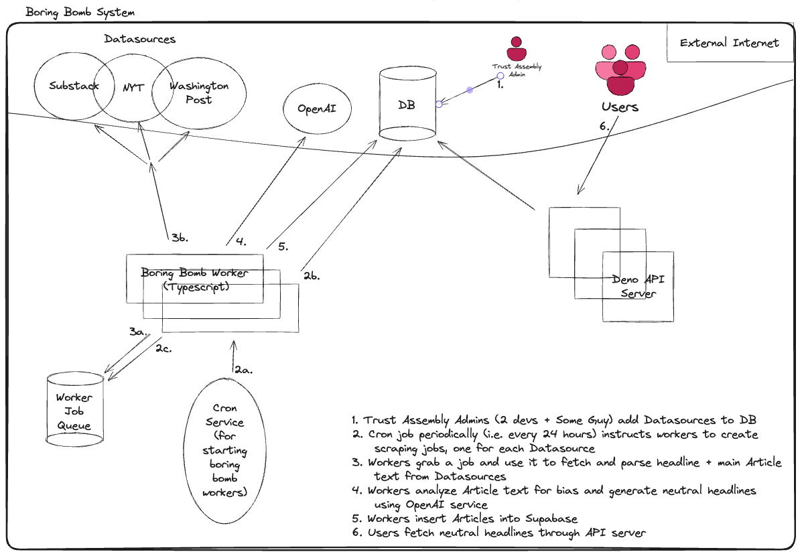

# Boring Bomb V1 Architecture

## 💣 🏗️ Boring Bomb Worker Flow & Architecture Doc

### Overview of Purpose

The BB (Boring Bomb) Workers contain the main logic for the Boring Bomb subsystem of Trust Assembly. The Workers use a pub/sub approach to generate the neutral headlines of `Articles`  where those `Articles` were fetched by scraping article data from a set of `Datasources`.

### Architecture Doc

### Worker Flow

The process from initial empty DB to neutral headlines fetchable by users is as follows:

1. Each `Datasource` will be inserted into the DB manually by a Trust Assembly Admin (to keep it simple and secure, this should be a small group of people, like 2 devs + Some Guy). For those `Datasources` that we want to have a particular prompt, we’ll also add a `DatasourceOwner` that is associated with the `Datasource`, and will contain an LLM prompt that will influence the creation of headlines. The `DatasourceOwner` exists because we want the ability for media figures (such as Astral Codex Ten’s Scott Alexander) to influence the “voice” of each generated headline (see the [requirements doc “Text Scraper/LLM”](https://docs.google.com/document/d/14L_ISiWFZyVw1rF18uP68bQ16SMYAT3XqygxxOVrEjY/edit?tab=t.0) for more reasoning on this).
    1. In the future, we’ll need to write a frontend for allowing verified media figures to create their own `DatasourceOwner` and attach is to 1 or more `Datasource`s, and we’ll need a way to verify they are indeed the owner of that `Datasource`. We will not do this now, and instead use manual updates to the DB until manual updates become too burdensome.
    2. In the future if needed, we can add Auth functionality to the DB and write a frontend for Trust Assembly devs who don’t have access to the DB to add more `Datasources`, but in this MVP we’re making the decision to rely on direct DB inserts to add/update/delete `Datasources` and `DatasourceOwners`
2. A cron job (or any function called periodically) will call a function on the Workers to fetch the `Datasource`s, and use them to insert jobs into the Worker Job Queue. Each job consists of a `Datasource` (for example a url like https://extelligence.substack.com/archive)
3. The same Workers will subscribe to the job queue and one by one consume a job by using the `Datasources` to determine which URLs to fetch and parse. There will be some non-trivial logic here for how to use a `Datasource` along with existing `Articles` to determine which publications (i.e. specific article URL’s, like https://extelligence.substack.com/p/the-norwegian-butter-knife) need to have their headlines analyzed, and which already have `Article` s in the DB from a previous successfully completed job.
4. Once the headline data is parsed, Workers will use OpenAI to analyze their original headlines & original article text to detect bias, and if the headline is biased then the Worker will use OpenAI to generate an unbiased headline.
5. The worker will insert the unbiased headline into the DB as an `Article`. The Worker will also extract and insert the main article text into the `Article` . This isn’t useful for the MVP for Boring Bomb, but will be useful when we later move beyond the MVP to using a wiki to host main article text edits and Trust Assembly Adjudication.
6. Finally, a user with the Trust Assembly browser extension visits a website, and the extension uses the API to fetch a headline for the article they’re reading. If no `Article` exists in our DB, then nothing will be changed about their website’s article. If one does exist, then the extension will use the unbiased headline from the `Article`

## 🧑‍💼 Business Objects and Their Relations

1. `Datasource`
    1. id
    2. parent_id (if the url to the same article has changed over time, then the new `Datasource` will have the prior `Datasource` as its parent_id)
    3. base_url (i.e. [`https://extelligence.substack.com/archive`](https://extelligence.substack.com/archive))
    4. owner_id
    5. time_last_scraped
2. `Article`
    1. id
    2. original_text
    3. headline_text
    4. edit_pairs (this will be an array of [original_text, edited text] tuples, where `original_text` is the original sentence/paragraph/section of text, and `edited_text` is the text to replace the `original_text` with)
    5. parent_id (if the article original_text has changed over time, then there will be a new `Article` whose parent_id points to the previous `Article`)
    6. datasource_id
    7. url
    8. time_created
    9. time_last_updated
3. `DatasourceOwner` (this is not for auth, but rather for the prompt we’ll use to influence the voice of the generated Headline)
    1. id
    2. prompt_text
    3. prompt_text_arguments (the prompt text is expected )
    4. name
    5. email_contact
    6. website

## 🧩 Deno API Server Definitions (For Browser Extension)

This is very simple, because at the end of the day all boring bomb is trying to do is generate unbiased headlines for articles, and make those headlines available to the user.

### Client Boring Bomb API

1. `GET /headline`

## ❓Remaining Questions

1. How will scraping work be distributed amongst the workers?
2. How will worker and API logs be collected, queried, and viewed?
3. If the URL for a site changes, how do we determine the new `Datasource` which will have the `Datasource` with the previous URL as its `parent_id`?
4. How much does an `Article` need to mutate before we create a new `Article` that references the old `Article` as its `parent_id`?
5. How will Boring Bomb acquire and maintain access to paywalled `Datasources` like NYT and other paid subscription articles?
6. Should we include images in our system? Storing image data will greatly increase the amount of space we need to pay for, and require a different type of storage (i.e. blob storage like S3 or Cloudflare’s R2), but images may contain important information. One way to get the best of both worlds may be to simply store image caption data if it exists, or have AI do a synopsis of the image and just storage that. The question to answer is: what benefit does storing image data give to Trust Assembly?
7. Which programming language should we use? Which has the best support for scraping websites, logging into to paywalled websites?
8. How do we organize the hierarchy of scraper code, such that we reuse similar logic for similar sites (i.e. all the substack-based `Datasources`) and are still able to correctly scrape publishers without huge maintenance overhead? From looking at github code for scraping popular media outlets, it all looks pretty manual, because most do not provide APIs)

## ⛺ Non-functional Requirements (CAMPS Considerations)

Consistency:

1. I think things are simple enough, and there are no sequential operations that need to be transactional, so consistency is not a big concern
2. we should make the pipeline idempotent, so that we can safely retry Article creation without worrying about duplicates and unforeseen inconsistencies

Availability:

1. If a datasource is unreachable, then nothing can be created
2. If a datasource doesn’t have a owner_id, then we should use some generic prompt to create the headlines

Maintainability:

1. This is part of an open source project with unpaid workers, so documentation and legibility are very important, otherwise the high churn of an open source team means we’ll lose a lot of codebase knowledge
2. ideally we make the flow of the data pipeline unidirectional, because cycles introduce complexity
3. retries are needed to handle errant Datasource failures
4. Handling the legality of scraping articles will be very difficult (a game of cat and mouse) or very costly
5. A human operator will need to add the DatasourceOwners, or we’ll need to make some frontend for people claim Datasources, at which point we’ll issue a challenge to them (basically a long random sequence of characters) which they then need to place on their website to prove they control it, and finally one of us verifies this and then adds them as a DatasourceOwner in control of the given datasource)

Performance:

1. Parallelization is needed to deal with the large number of datasources to be scraped
2. perhaps compressing text will reduce DB bills, but also impacts Maintanability because it means we can’t do raw sql queries since the text will look like gibberish (maybe there’s a way for postgres to compress/uncompress on the fly?)
3. There will be a single admin writer that we control, and many many readers of the same article text
4. Boring Bomb will take good advantage of caching, because once an Article is created, it will not mutate until some humans changes the upstream 

Security:

1. the admin panel that adds DatasourceOwners in Maintainability.e will need to be secure
2. The Boring Bomb infra and code generation will need to have no single point of failure and all use 2FA with unique passwords, otherwise any headline and any prompt can be used, which a malicious Mallory could use to discredit Trust Assembly
3. The Supabase DB will need 2FA with unique passwords
4. The OpenAI (or whatever LLM API we use) owner will need 2FA with unique passwords. And we’ll need to store that secret in some sort of secrets manager, and access to that manager cannot have a single point of failure

## 📊 Estimated Usage Metrics

The follow sections contain estimates of usage, based on some best-guess estimates of user behavior

### Usage Assumptions

- **U** Number of Users: 0 - 30 million ([number of digital subscribers to top English-language news websites](https://www.statista.com/statistics/785919/worldwide-number-of-digital-newspaper-subscribers/))
- **APD** Articles Per Day: 250 * 15 + 1000 ~= 5000 (250 articles posted by Washington Post per day, multiplied by the top 15 mainstream media outlets, with 1000 substack writers (1000 was pulled out of my ass))
- **ARU** Number of Articles Read per day per user: 2 to 10 (this is solely based on my own article reading experience, if someone has a better source for estimating this please replace!)
- **HRS** Headline Request Size: 0.25 kb ([based on some stat I found online](https://www.prsa.org/article/what-s-the-best-press-release-headline-length) which says average is 120 chars, so I doubled it to be sure)
- **ARS** main Article Request Size: 12kb (2000 words * average number of 5.6 characters per word, [based on some stat I found online](https://draft.co/blog/the-ideal-length-for-every-type-of-content), and my own perusal of several articles from popular media outlets. If we compress it it can be 10x less space, but that would hurt maintainability because we’ll be storing compressed text instead of human-readable text which is useful for debugging)